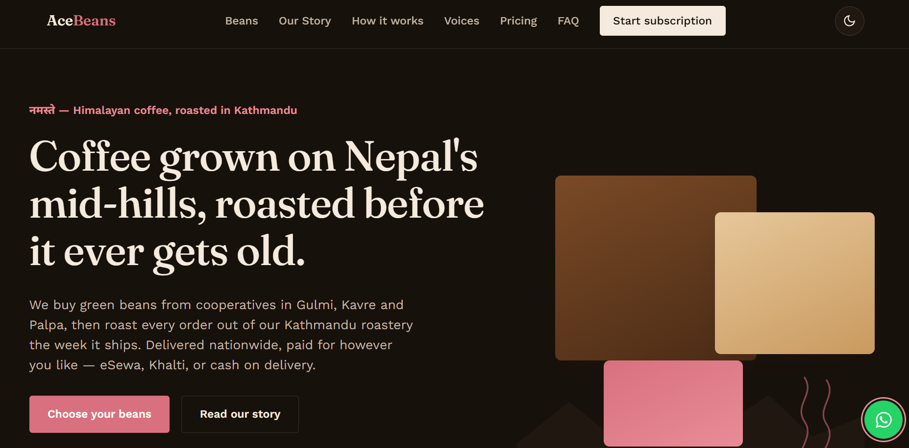
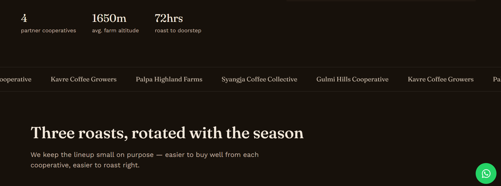
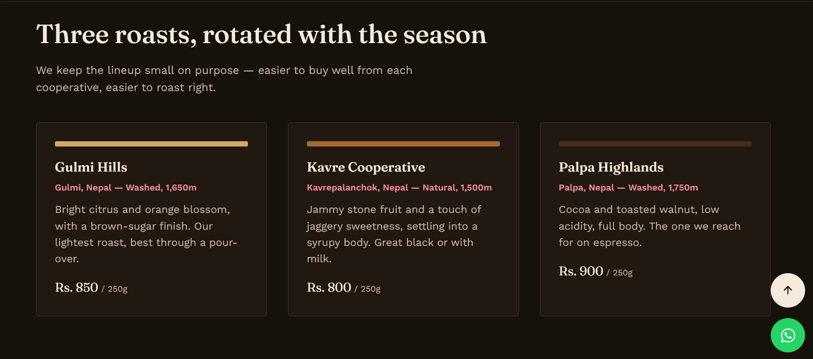
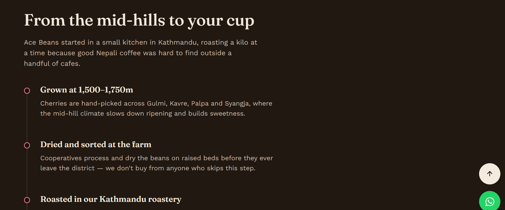
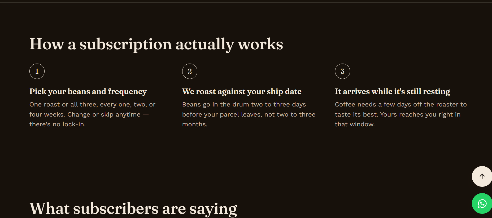
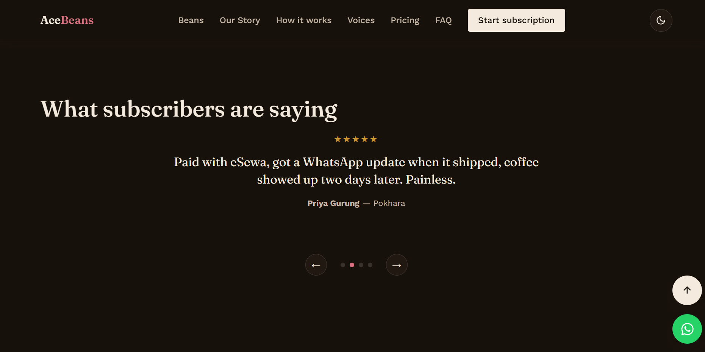
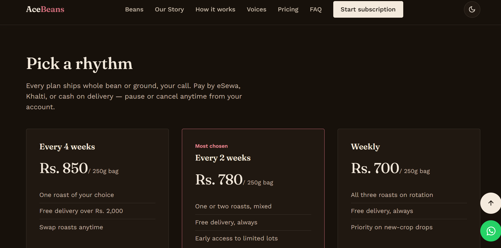
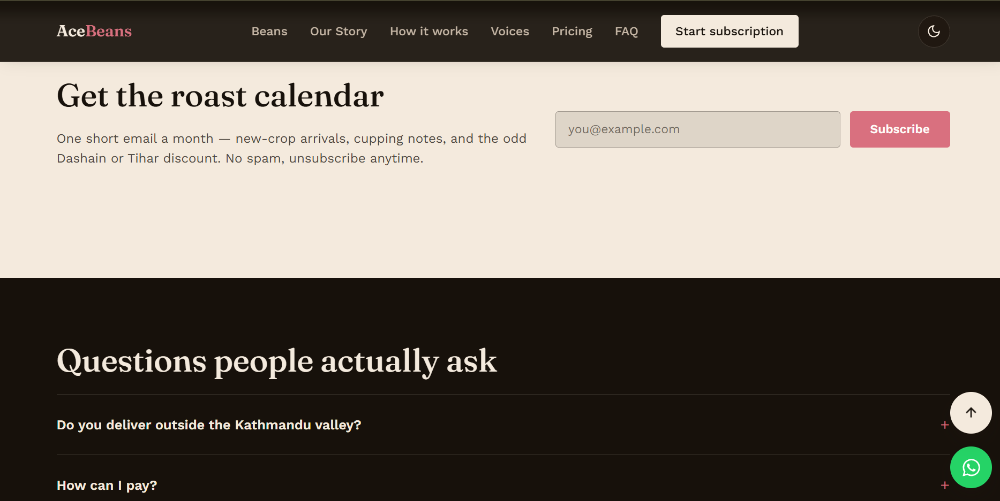
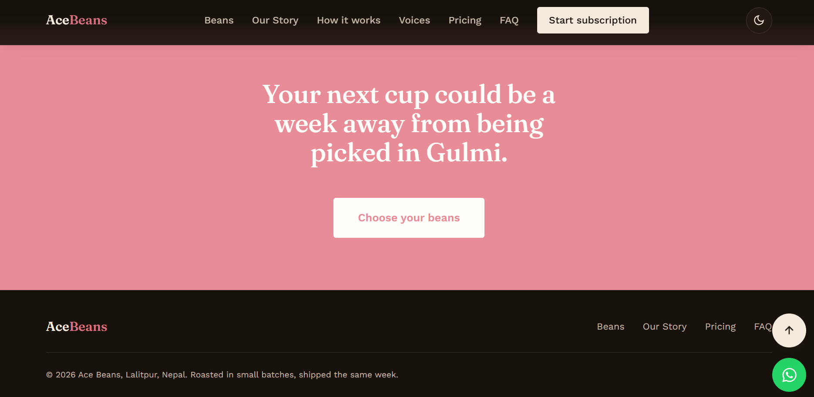

# Ace Beans — Responsive Landing Page

A responsive landing page for **Ace Beans**, a concept coffee subscription brand based in Nepal. Green beans are sourced from mid-hill cooperatives in Gulmi, Kavre, and Palpa, then roasted in small batches out of a Kathmandu roastery so customers get coffee just days off the roaster instead of beans that have sat in a warehouse for months.

Built with vanilla HTML, CSS, and JavaScript — no frameworks, no build step. Just unzip and open `index.html`.

## Live Demo Link: 
ace-beans.vercel.app 

## Live features

- **Responsive layout** — fluid type and spacing, grid layouts that collapse cleanly from desktop down to mobile
- **Sticky navigation** with a mobile hamburger menu
- **Dark / light mode toggle**, preference saved in `localStorage`
- **Hero section** with animated, count-up stats (triggered on scroll via `IntersectionObserver`)
- **Bean lineup** — three single-origin roasts with tasting notes and Nepali Rupee (Rs.) pricing
- **Origin story timeline** — farm → drying → roastery → delivery
- **"How it works"** — 3-step subscription explainer
- **Testimonial carousel** — autoplay, dot navigation, prev/next controls, pauses on hover
- **Pricing tiers** — weekly / biweekly / every-4-weeks plans, priced in Rs.
- **Newsletter signup** — client-side email validation, no backend wired up
- **FAQ accordion** — one section open at a time
- **Floating WhatsApp button** — links directly to `+977 9746553700` for direct customer DMs
- **Back-to-top button**
- Respects `prefers-reduced-motion` and keeps visible keyboard focus states throughout

## Screenshots of Website










## Project structure

```
ace-beans/
├── index.html        # Page structure and content
├── css/
│   └── styles.css    # Design tokens, layout, responsive rules, dark mode
├── js/
│   └── script.js      # Nav, theme toggle, counters, carousel, forms
└── README.md
```

## Running it locally

No build tools required. Either:

1. Double-click `index.html` to open it directly in a browser, or
2. Serve it locally for a closer-to-production feel:
   ```bash
   cd ace-beans
   python3 -m http.server 8000
   # then visit http://localhost:8000
   ```

## Customizing

- **Colors / type / spacing** — all defined as CSS custom properties at the top of `css/styles.css` (`:root` for light mode, `[data-theme="dark"]` for dark mode)
- **Copy and pricing** — edit directly in `index.html`
- **WhatsApp number** — update the `href="https://wa.me/..."` value on the floating button near the bottom of `index.html`
- **Newsletter / order actions** — currently front-end only; wire the `<form>` submit handlers in `js/script.js` up to a real backend or service (e.g. Mailchimp, a serverless function, eSewa/Khalti checkout) to go live

## Images

Photos (hero collage, bean cards, and the "Our Story" timeline) are hotlinked from [Pexels](https://www.pexels.com), which are free to use for commercial projects with no attribution required. They're placeholders standing in for real farm/roastery photography.
## Tech notes

- Fonts: [Fraunces](https://fonts.google.com/specimen/Fraunces) (display), [Work Sans](https://fonts.google.com/specimen/Work+Sans) (body), [Noto Sans Devanagari](https://fonts.google.com/noto/specimen/Noto+Sans+Devanagari) (for the नमस्ते accent) — loaded from Google Fonts
- No external JS libraries — the carousel, counters, and theme toggle are all hand-written vanilla JS
- Breakpoints at `960px` and `720px`

## License / status

This is a coursework / portfolio project built around a fictional brand concept. Not a live business — swap in real content, payment integrations, and legal pages before using it for an actual company.
